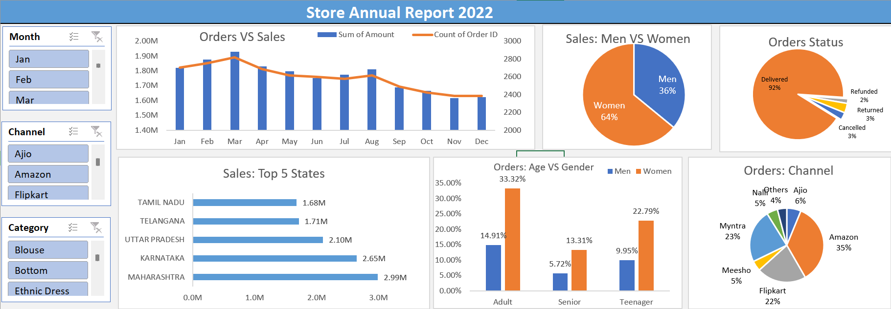

# 🛍️ Retail Store Sales Analysis Dashboard

## 📊 **Project Overview**

This is my **first Excel dashboard project**, analysing retail store sales data to derive actionable business insights and build my data analytics skills.

---

## 🔍 **Objective**

- Analyse monthly sales trends  
- Compare sales across gender and age groups  
- Identify top-performing states  
- Evaluate sales channel contributions  
- Practice dashboard design using Pivot Tables and Charts

---

## 🗃️ **Dataset Summary**

- **Total Orders:** 31,047  
- **Year:** 2022  
- **Data Fields:** Order ID, Customer ID, Gender, Age, Month, Status, Channel, Category, Amount, State

---

## 💡 **Key Insights**

- **Highest sales** in March and April (Q1 growth)  
- **Women shoppers** contribute ~65% of revenue  
- **Top states:** Maharashtra, Karnataka, Uttar Pradesh  
- **Sales channels:** Amazon (35%+ orders), Flipkart, Myntra  
- **Age group:** Majority buyers are Adults (18-59)

---

## 🛠️ **Tools Used**

- **Microsoft Excel**
  - Data Cleaning
  - Pivot Tables
  - Charts & Dashboards

---

## 🚀 **Skills Practiced**

- Data summarisation  
- Business insights extraction  
- Dashboard visualisation  
- Data-driven storytelling

---

## 🔮 **Future Scope**

- Extend analysis to regional pricing strategies  
- Visualise trends using Power BI for interactive dashboards  
- Apply statistical analysis for deeper business recommendations

---

## 🤝 **Connect with Me**

I am building my analytics portfolio and open to feedback, learning, and collaborations.

[LinkedIn](https://www.linkedin.com/in/musharraf-bubere-46b34b2a6/) | [GitHub](https://github.com/Musharraf-Bubere)

---

